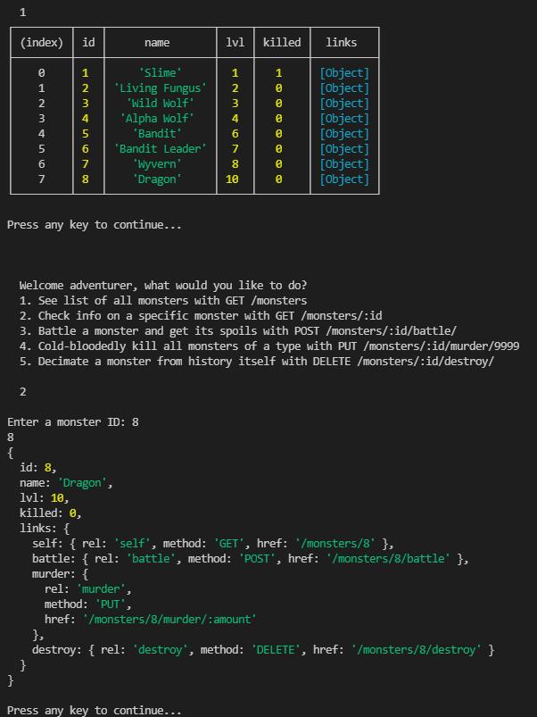

Material de referência (importantíssimo que consultem!):  
https://restfulapi.net/  
  
  
## 1  
Usar Node.js para criar um serviço REST, que utilize os verbos HTTP (POST, GET, PUT, DELETE), equivalentes às operações de CRUD (Create, Read, Update, Delete), quando aplicável.  
O serviço dever conter pelo menos um recurso que represente uma lista (ex: dias da semana) na qual cada item da lista possui uma sublista (ex: lista de tarefas a fazer para cada dia da semana).  
Você escolhe o que é essa lista (filmes e atores, pedidos e produtos, partidos e candidatos).  
Não precisa de banco de dados. Pode ser um misto de hard-coded e dados na memória.  
Estrutura exemplo para os dados (considerando os exemplos dos parênteses no enunciado):  
  
```json
{
    "segunda": [  
        {"id": 1, "tarefa": "Fazer exercício de gRPC", "done": true}  
    ],
    "terça": [  
        {"id": 7,"tarefa": "Ver tutorial de Node.js sobre HTTP e REST", "done": false},  
        {"id": 8,"tarefa": "Fazer exercício sobre HTTP e REST", "done": false}  
    ]  
}  
```

OBS: A sua API não precisa retornar a lista toda de uma vez. Podem ser os itens do primeiro nível  (ex: dias com tarefa), permitindo navegação para o detalhamento no segundo nível (ex: tarefa de um dia específico).  
  
A ideia com este exercício é praticar a criação de APIs seguindo o estilo arquitetural REST, mas garantindo o princípio de Uniform Interface, que engloba:  
I. Identificação de recursos: Uso de URIs únicas para descrever recursos (um recurso deve ter apenas uma URI)  
II. Manipulação de recursos através de representações: o mesmo recurso deve estar disponível em diferentes representações (ex: XML e JSON)  
III. Mensagem auto descritivas: Uso correto dos cabeçalhos HTTP para descrever as requisições e respostas.  
IV. Hypermedia as the engine of application state (HATEOAS): Uso de links navegáveis dos recursos (ver exemplo aqui: https://restfulapi.net/hateoas/)  
  
  
## 2  
Escrever uma aplicação cliente (pode ser no console) que consuma a API.  
  
  
## Que decisões envolveram a escolha da nomenclatura dos recursos?  
Utilizei a semântica de <Recurso>/:id/<Ação> de forma que ficasse consistente e hierárquico.  
  
## Que cabeçalhos HTTP estiveram envolvidos para garantir as quatro diretrizes acima?  
GET, POST, PUT e DELETE
  
  
## Resultado no cliente

