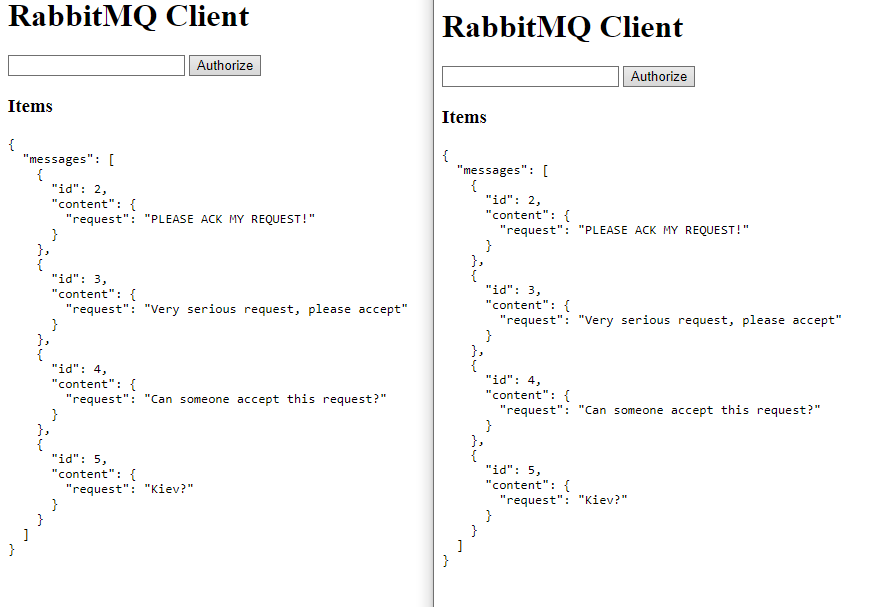
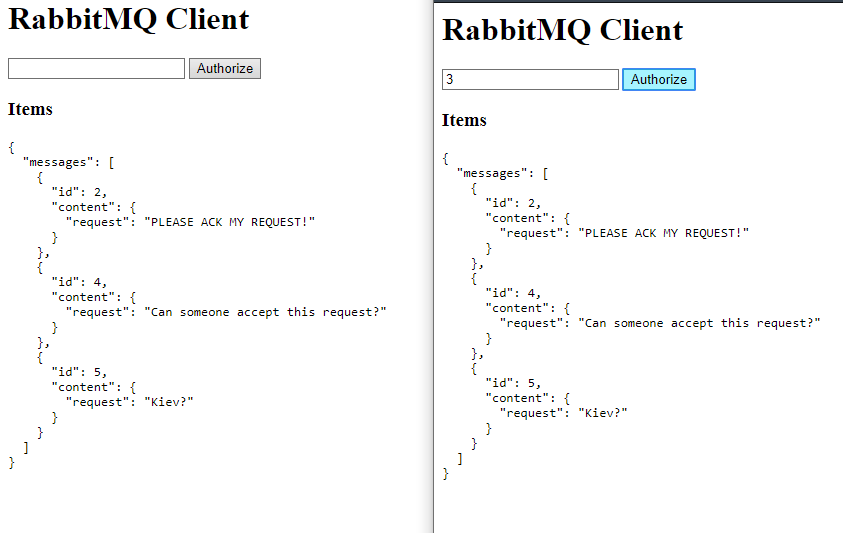

## Implementação com Web Sockets e Filas de mensagem  
Através de uma fila de mensagem, uma aplicação envia a um servidor pedidos a serem autorizados.  
Através de um browser, diferentes usuários podem acessar o servidor e visualizar os pedidos que precisam de autorização.  
O browser deve se conectar ao servidor através de um WebSocket para efetuar as autorizações.  
Note que a visualização dos pedidos não deverá removê-los da fila.  
Apenas a autorização deverá removê-lo.  

Caso não consiga implementar, explique textualmente e com diagramas como poderia ser implementado  

## Questões para discussão:  
### 1. Qual a principal diferença entre cada exemplo dos tutoriais seguidos?  
Cada exemplo explora um esquema de filas e canais diferente, mostrando a versatilidade do RabbitMQ.  
  
### 2. Suponha que o seu servidor de filas (rabbitmq-server) está executando e possui filas que contém mensagens ainda não consumidas, e acidentalmente a máquina em que ele roda reinicia, como se pode garantir que as mensagens estarão salvas quando o servidor de filas voltar a funcionar?  
Usando Durable no RabbitMQ, as mensagens são mantidas quando o servidor de filas é reiniciado.  
   
## Screenshots

