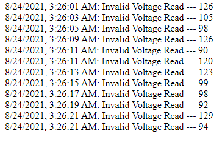
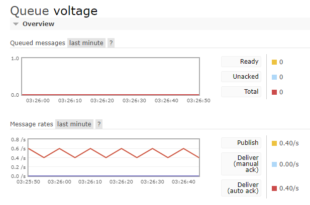
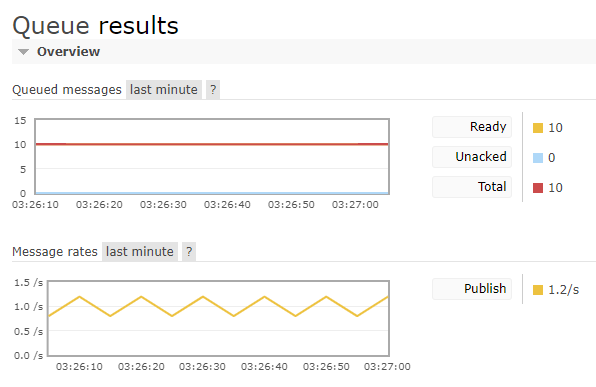
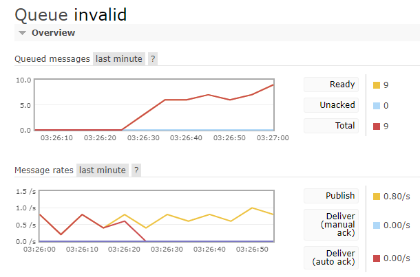

# Exercício Programação Reativa

## 1.
Usando um source WebSocket (exemplo abaixo) que notifica a voltagem que é alimentada para um equipamento qualquer, escreva uma aplicação em NodeJS que cria um filtro em cima deste source, usando RxJS.  
Os elementos filtrados devem seguir a regra: 105 <= valor <= 120  
Isso deverá gerar um evento que indica a voltagem em uma faixa indesejada, e que deverá ser publicados em uma fila no RabbitMQ.  

## 2.
A partir do exercício 1, considere que além do source WebSocket há outro source (RabbitMQ ou gRPC stream, à sua escolha) enviando a voltagem alimentada a dois equipamentos, respectivamente.  
Use o RxJS para fazer merge nos dados dos dois sources e depois aplique o mesmo filtro de antes.  
O resultado deverá ser publicado da mesma forma, em uma fila no RabbitMQ. 
Adicione um programa que publica através de Server-Sent Events, que consome da fila RabbitMQ onde o evento é publicado.

## Questões para discussão:
### 1. Qual o principal ponto para se tratar os sources com RxJS?  
RxJS é muito complicado de usar, mesmo não sendo tão difícil de entender.  
O merge e os observables sempre davam algum erro do lado da lib, mas eventualmente deu tudo certo.  

### 2. Quais as principais dificuldades com a resolução do exercício?  
Muita intercomunicação entre diferentes serviços, um grande vai e vem de informações.  

## Screenshots
  
  
  
  
